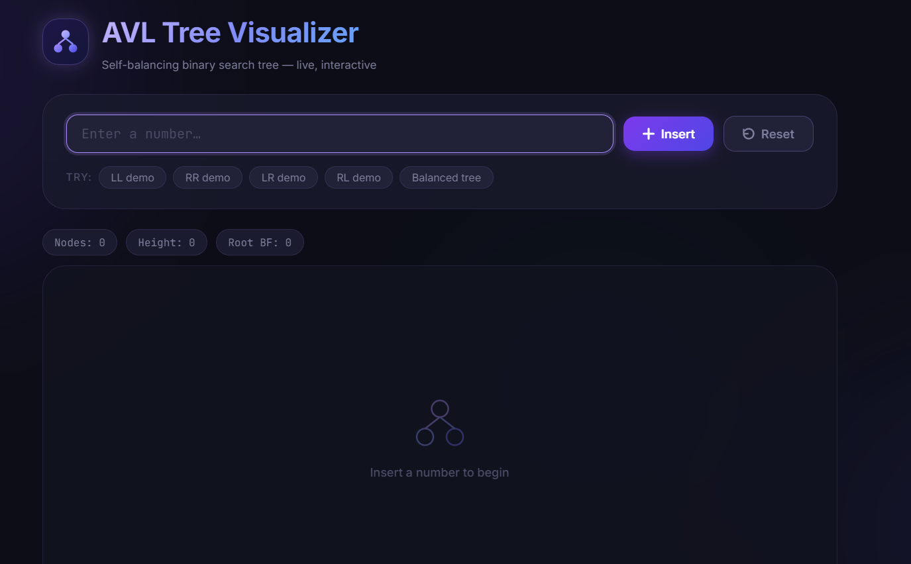
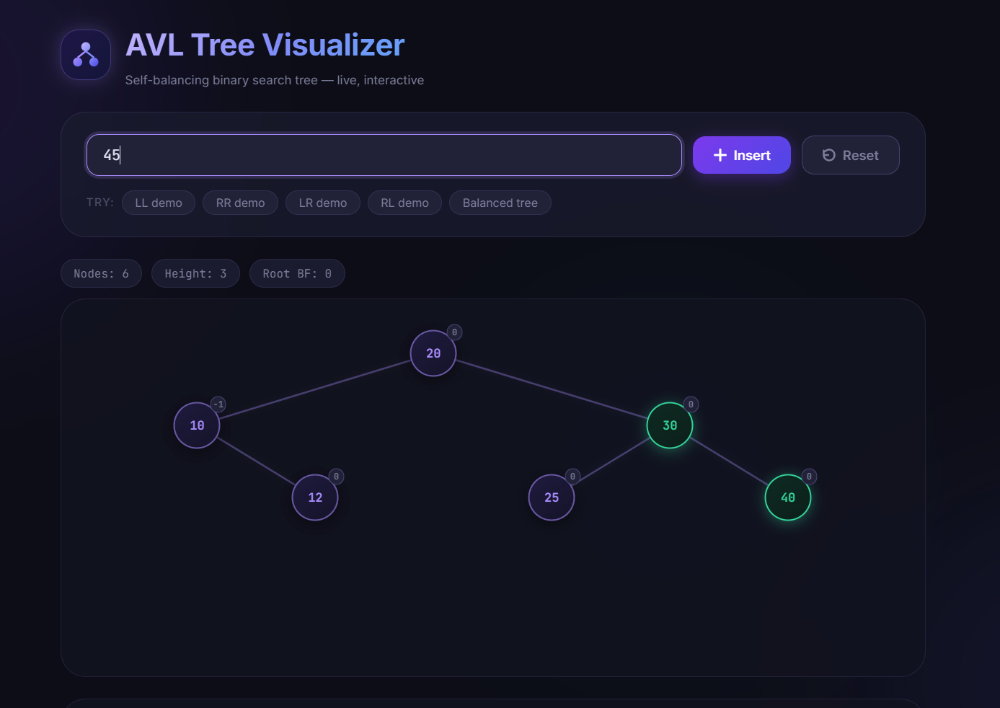
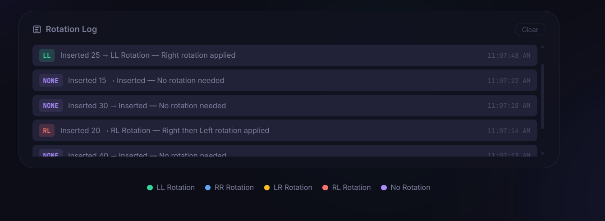

# AVL Tree Visualizer

An interactive, browser-based visualization of an AVL (Adelson-Velsky and Landis) self-balancing binary search tree, built with pure HTML, CSS, and vanilla JavaScript — no frameworks.

**Try it here:** https://avltreevisdeploy.vercel.app/

## Preview

## Features

- **Live Rebalancing**: Insert numbers one at a time and watch the tree rebalance itself automatically.
- **Rotation Tracking**: Color-coded highlights plus a live log identifying each rotation as LL, RR, LR, or RL.
- **Balance Factor Badges**: Every node displays its balance factor, updated in real time.
- **Stats Bar**: Running counts for total nodes, tree height, and root balance factor.
- **Demo Sequences**: One-click preloaded insertions that reliably trigger each rotation case.
- **SVG Edges**: Parent-child connections redraw dynamically as the tree restructures.

---

## In Action

| After a Rotation                           | Rotation Log                             |
| ------------------------------------------ | ---------------------------------------- |
|  |  |

---

## Installation

1. Clone or download this repository.
2. Open `index.html` directly in any modern browser (Chrome, Firefox, Edge, Safari).
3. If your browser restricts local files, serve the folder instead: `python -m http.server 8000`, then visit `http://localhost:8000`.

---

## Tech Stack

- **Frontend**: HTML5, CSS3, JavaScript (ES6+)
- **Rendering**: SVG for dynamic edge connections
- **Reference implementation**: `avltree.java` — a standalone console AVL insert/rotation implementation with an ASCII tree printer, kept separate from the browser visualizer

---

## How It Works

An AVL tree keeps the height difference between a node's left and right subtrees (its balance factor) at -1, 0, or 1. When an insertion pushes that value to +2 or -2, the tree performs one of four rotations to restore balance:

| Case | Trigger                                       | Fix                                |
| ---- | --------------------------------------------- | ---------------------------------- |
| LL   | Insertion into left subtree of a left child   | Single right rotation              |
| RR   | Insertion into right subtree of a right child | Single left rotation               |
| LR   | Insertion into right subtree of a left child  | Left rotation, then right rotation |
| RL   | Insertion into left subtree of a right child  | Right rotation, then left rotation |

This keeps search, insert, and delete at O(log n), even in the worst case — unlike an unbalanced BST, which can degrade to O(n) on sorted input.

---

## Author

Made by **Siddarth K**
